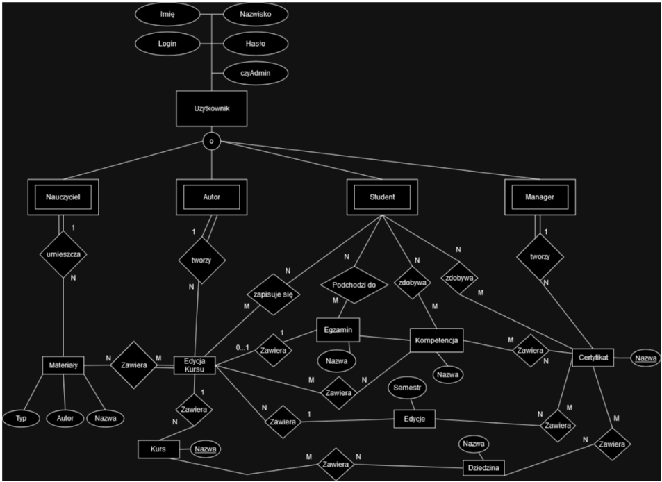
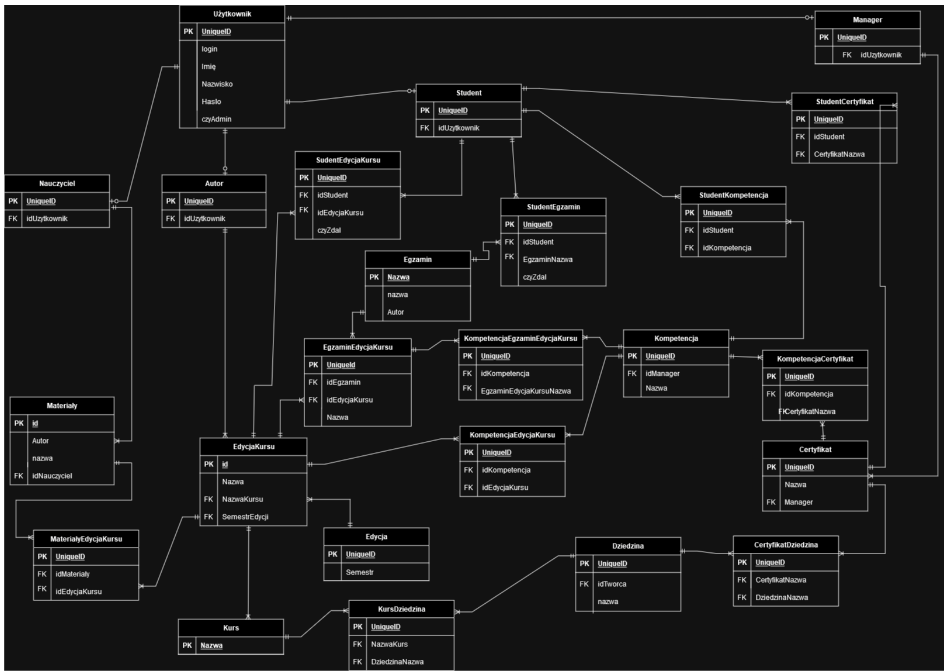
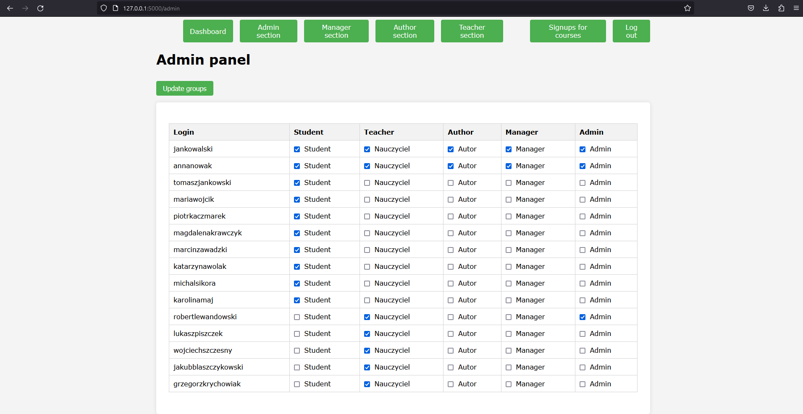
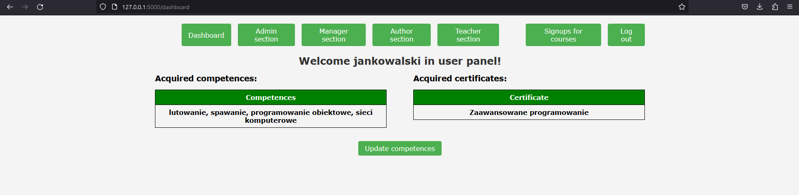
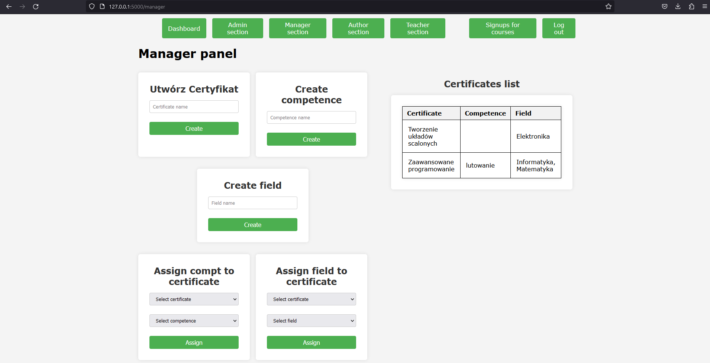
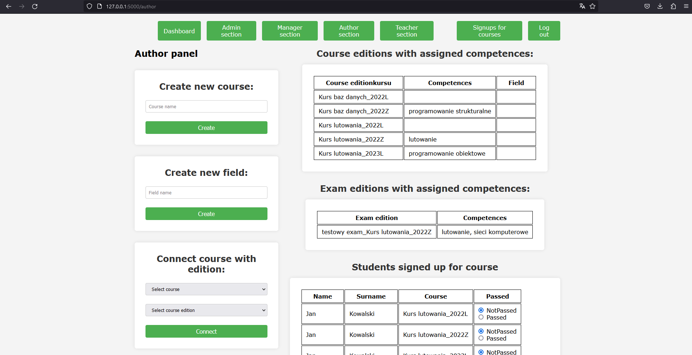
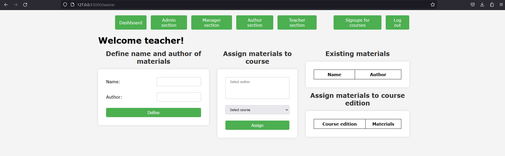

# Fundamentals Of Database Systems
This is project created for project Fundamentals Of Database Systems.  
It is web application used for signing up for courses and exams.
From them you acquire competences.  
If student have enough specific competences he acquires certificates.  
Different users have different roles to create different things. :)

- EER Diagram
    

- Logical Schema of database
    

- Few photos from GUI.
    - Admin:
        
  
    - Dashboard
          

    - Manager:
        
  
    - Author:
        
  
    - Teacher:
        
